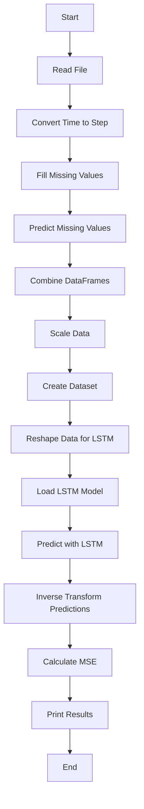

###  Nghiên cứu dữ liệu ICU Mortality Data:
1. **Flow Chart - Quy trình xử lý dữ liệu**:

### Mathematical Model Summary:

### Next:

2. **Hướng dẫn Cài đặt và Chạy Code**:
   - Bước 1: Tạo môi trường ảo co Python (phiên bản 3.x)
     ## Windows:
     		py -m venv .venv
     ## Unix/MacOS:
     		python -m venv .venv
   - Bước 2: Kích hoạt môi trường:
     ## Windows:
     		.venv\Scripts\activate.bat
     ## Unix/MacOS:
     		source .venv/bin/activate
     
   - Bước 3: Cài đặt các thư viện cần thiết
     ## Install:
     		pip install -r requirements.txt
   - Bước 4: Chạy mã xử lý dữ liệu
     ## Run:
    		python data_process.py
    		
 **Chi tiết Quy trình**:
   # Dữ liệu đọc từ data file :
   
    
   # Convert time to step:

   # Filled missing values 

   # Predicted missing values with XGBRegressor

   # Build LSTM 

